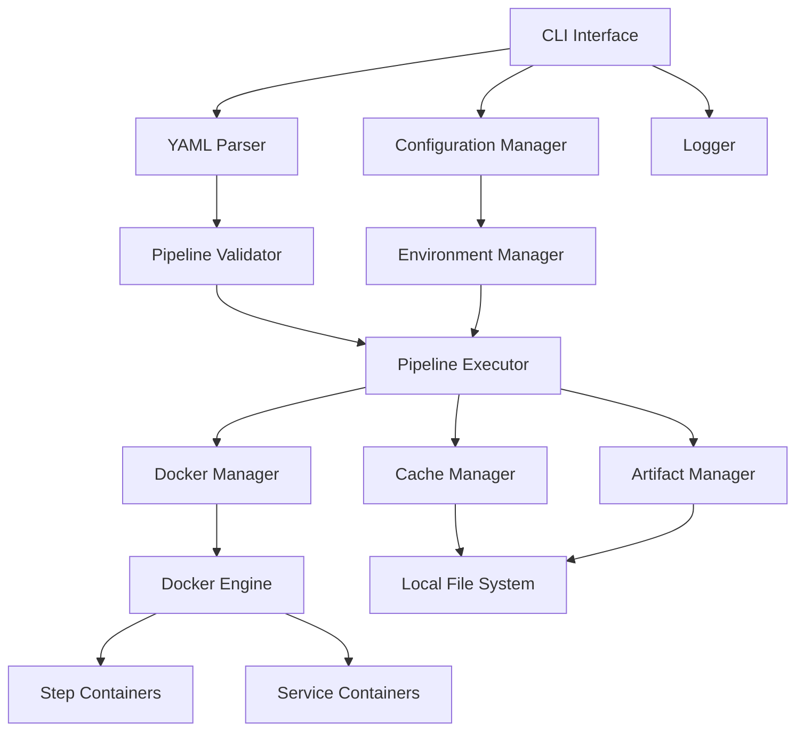

# 設計書

## 概要

Bitbucket Pipelinesローカルランナーは、`bitbucket-pipelines.yml`ファイルを解析し、Dockerコンテナを使用してパイプラインステップをローカル環境で実行するツールです。開発者がパイプライン設定をテストし、デバッグできるようにすることで、開発効率を向上させます。

## アーキテクチャ

### システム構成図



### レイヤー構成

1. **CLI Layer**: ユーザーインターフェース
2. **Core Layer**: パイプライン実行エンジン
3. **Manager Layer**: リソース管理
4. **Infrastructure Layer**: Docker、ファイルシステム

## コンポーネントとインターフェース

### 1. CLI Interface

```typescript
interface CLIOptions {
  pipeline?: string;           // 実行するパイプライン名
  branch?: string;            // ブランチ名
  custom?: string;            // カスタムパイプライン名
  verbose?: boolean;          // 詳細ログ
  dryRun?: boolean;          // ドライラン
  configFile?: string;       // 設定ファイルパス
  envFile?: string;          // 環境変数ファイル
  clearCache?: boolean;      // キャッシュクリア
}

interface CLICommand {
  run(options: CLIOptions): Promise<void>;
  validate(options: CLIOptions): Promise<boolean>;
  listPipelines(): Promise<string[]>;
  clearCache(): Promise<void>;
}
```

### 2. YAML Parser

```typescript
interface PipelineConfig {
  image?: string | ImageConfig;
  options?: GlobalOptions;
  clone?: CloneConfig;
  definitions?: Definitions;
  pipelines: Pipelines;
}

interface ImageConfig {
  name: string;
  username?: string;
  password?: string;
  aws?: AWSConfig;
  runAsUser?: number;
}

interface Step {
  name?: string;
  image?: string | ImageConfig;
  script: string[];
  size?: string;
  maxTime?: number;
  caches?: string[];
  artifacts?: ArtifactConfig;
  services?: string[];
  trigger?: 'automatic' | 'manual';
  condition?: ConditionConfig;
  afterScript?: string[];
}

interface ParallelSteps {
  failFast?: boolean;
  steps: Step[];
}
```

### 3. Pipeline Executor

```typescript
interface PipelineExecutor {
  execute(config: PipelineConfig, options: ExecutionOptions): Promise<ExecutionResult>;
  executeStep(step: Step, context: ExecutionContext): Promise<StepResult>;
  executeParallel(parallel: ParallelSteps, context: ExecutionContext): Promise<StepResult[]>;
}

interface ExecutionContext {
  workspaceDir: string;
  artifactsDir: string;
  cacheDir: string;
  environment: Record<string, string>;
  services: ServiceContainer[];
}

interface ExecutionResult {
  success: boolean;
  steps: StepResult[];
  duration: number;
  error?: Error;
}

interface StepResult {
  name: string;
  success: boolean;
  exitCode: number;
  duration: number;
  logs: string[];
  error?: Error;
}
```

### 4. Docker Manager

```typescript
interface DockerManager {
  pullImage(image: string, auth?: AuthConfig): Promise<void>;
  createContainer(config: ContainerConfig): Promise<Container>;
  runContainer(container: Container): Promise<ContainerResult>;
  stopContainer(containerId: string): Promise<void>;
  removeContainer(containerId: string): Promise<void>;
  createNetwork(name: string): Promise<Network>;
  removeNetwork(networkId: string): Promise<void>;
}

interface ContainerConfig {
  image: string;
  command: string[];
  environment: Record<string, string>;
  volumes: VolumeMount[];
  workingDir: string;
  network?: string;
  user?: string;
  memoryLimit?: string;
  cpuLimit?: string;
}

interface VolumeMount {
  source: string;
  target: string;
  readonly?: boolean;
}
```

### 5. Cache Manager

```typescript
interface CacheManager {
  getCachePath(cacheName: string): string;
  restoreCache(cacheName: string, targetPath: string): Promise<boolean>;
  saveCache(cacheName: string, sourcePath: string): Promise<void>;
  clearCache(cacheName?: string): Promise<void>;
  listCaches(): Promise<string[]>;
}

interface CacheConfig {
  name: string;
  path: string;
  pattern?: string;
}
```

### 6. Artifact Manager

```typescript
interface ArtifactManager {
  saveArtifacts(patterns: string[], sourceDir: string, stepName: string): Promise<void>;
  restoreArtifacts(targetDir: string, stepName?: string): Promise<void>;
  listArtifacts(stepName?: string): Promise<string[]>;
  clearArtifacts(): Promise<void>;
}

interface ArtifactConfig {
  paths: string[];
  download?: boolean;
}
```

### 7. Environment Manager

```typescript
interface EnvironmentManager {
  loadEnvironment(envFile?: string): Promise<Record<string, string>>;
  getBitbucketVariables(context: PipelineContext): Record<string, string>;
  mergeEnvironments(...envs: Record<string, string>[]): Record<string, string>;
  validateSecureVariables(variables: string[]): Promise<Record<string, string>>;
}

interface PipelineContext {
  branch: string;
  commit: string;
  buildNumber: number;
  repoName: string;
  workspace: string;
}
```

## データモデル

### 設定ファイル構造

```typescript
interface LocalRunnerConfig {
  docker: DockerConfig;
  cache: CacheConfig;
  artifacts: ArtifactConfig;
  logging: LoggingConfig;
  environment: EnvironmentConfig;
}

interface DockerConfig {
  registry?: RegistryConfig;
  defaultImage?: string;
  networkName?: string;
  volumePrefix?: string;
  resourceLimits?: ResourceLimits;
}

interface ResourceLimits {
  memory: Record<string, string>;  // "1x": "4g", "2x": "8g"
  cpu: Record<string, string>;     // "1x": "2", "2x": "4"
}

interface LoggingConfig {
  level: 'debug' | 'info' | 'warn' | 'error';
  format: 'text' | 'json';
  showDockerCommands: boolean;
  showTimestamps: boolean;
}
```

### 実行時データ構造

```typescript
interface PipelineExecution {
  id: string;
  config: PipelineConfig;
  context: ExecutionContext;
  steps: StepExecution[];
  startTime: Date;
  endTime?: Date;
  status: 'running' | 'success' | 'failed' | 'cancelled';
}

interface StepExecution {
  id: string;
  name: string;
  step: Step;
  container?: Container;
  services: ServiceContainer[];
  startTime: Date;
  endTime?: Date;
  status: 'pending' | 'running' | 'success' | 'failed' | 'skipped';
  logs: LogEntry[];
}

interface LogEntry {
  timestamp: Date;
  level: 'info' | 'warn' | 'error';
  source: 'system' | 'container' | 'docker';
  message: string;
}
```

## エラーハンドリング

### エラー分類

```typescript
enum ErrorType {
  YAML_PARSE_ERROR = 'yaml_parse_error',
  DOCKER_ERROR = 'docker_error',
  CONTAINER_ERROR = 'container_error',
  NETWORK_ERROR = 'network_error',
  FILE_SYSTEM_ERROR = 'file_system_error',
  VALIDATION_ERROR = 'validation_error',
  TIMEOUT_ERROR = 'timeout_error',
  USER_CANCELLED = 'user_cancelled'
}

class PipelineError extends Error {
  constructor(
    public type: ErrorType,
    message: string,
    public details?: any,
    public step?: string
  ) {
    super(message);
  }
}
```

### エラー処理戦略

1. **Graceful Degradation**: 非致命的エラーは警告として継続
2. **Resource Cleanup**: エラー時のコンテナ・ネットワーク清理
3. **Detailed Logging**: エラー原因の詳細な記録
4. **User-Friendly Messages**: 分かりやすいエラーメッセージ

### リトライ機能

```typescript
interface RetryConfig {
  maxAttempts: number;
  backoffMs: number;
  retryableErrors: ErrorType[];
}

class RetryManager {
  async executeWithRetry<T>(
    operation: () => Promise<T>,
    config: RetryConfig
  ): Promise<T> {
    // リトライロジック実装
  }
}
```

## テスト戦略

### テストレベル

1. **Unit Tests**: 各コンポーネントの単体テスト
2. **Integration Tests**: Docker統合テスト
3. **E2E Tests**: 実際のパイプライン実行テスト
4. **Performance Tests**: 大規模パイプラインのパフォーマンステスト

### テスト環境

```typescript
interface TestEnvironment {
  setupDocker(): Promise<void>;
  createTestPipeline(config: Partial<PipelineConfig>): PipelineConfig;
  cleanupContainers(): Promise<void>;
  mockBitbucketVariables(vars: Record<string, string>): void;
}
```

### テストデータ

```yaml
# テスト用パイプライン設定例
test-pipelines:
  simple:
    image: node:16
    pipelines:
      default:
        - step:
            script:
              - echo "Hello World"
              - npm --version
  
  with-services:
    definitions:
      services:
        postgres:
          image: postgres:13
          variables:
            POSTGRES_PASSWORD: test
    pipelines:
      default:
        - step:
            services:
              - postgres
            script:
              - pg_isready -h postgres
  
  parallel:
    pipelines:
      default:
        - parallel:
            steps:
              - step:
                  name: Test 1
                  script: [echo "test1"]
              - step:
                  name: Test 2
                  script: [echo "test2"]
```

## セキュリティ考慮事項

### コンテナセキュリティ

1. **非特権実行**: デフォルトで非rootユーザーで実行
2. **ネットワーク分離**: 専用ネットワークでの実行
3. **ボリューム制限**: 必要最小限のボリュームマウント
4. **リソース制限**: CPU・メモリ制限の適用

### シークレット管理

```typescript
interface SecretManager {
  loadSecrets(source: 'env' | 'file' | 'prompt'): Promise<Record<string, string>>;
  maskSecrets(logs: string[], secrets: string[]): string[];
  validateSecretAccess(secretName: string): boolean;
}
```

### ファイルシステムセキュリティ

1. **サンドボックス化**: 作業ディレクトリの制限
2. **権限管理**: 適切なファイル権限設定
3. **一時ファイル清理**: 実行後の一時ファイル削除

## パフォーマンス最適化

### 並列実行

```typescript
interface ParallelExecutor {
  executeParallel(
    steps: Step[],
    maxConcurrency: number,
    context: ExecutionContext
  ): Promise<StepResult[]>;
}
```

### キャッシュ最適化

1. **インクリメンタルキャッシュ**: 変更差分のみキャッシュ
2. **キャッシュ圧縮**: ディスク使用量削減
3. **キャッシュ有効期限**: 古いキャッシュの自動削除

### Docker最適化

1. **イメージキャッシュ**: プルしたイメージの再利用
2. **レイヤーキャッシュ**: Dockerビルドキャッシュ活用
3. **コンテナ再利用**: 同一イメージコンテナの再利用

## 監視とログ

### ログ構造

```typescript
interface LogConfig {
  level: LogLevel;
  format: 'text' | 'json' | 'structured';
  outputs: LogOutput[];
  includeTimestamp: boolean;
  includeLevel: boolean;
  includeSource: boolean;
}

interface LogOutput {
  type: 'console' | 'file' | 'syslog';
  config: any;
}
```

### メトリクス収集

```typescript
interface Metrics {
  executionTime: number;
  stepCount: number;
  parallelSteps: number;
  cacheHitRate: number;
  dockerPullTime: number;
  containerStartTime: number;
  memoryUsage: number;
  diskUsage: number;
}
```

## 拡張性

### プラグインシステム

```typescript
interface Plugin {
  name: string;
  version: string;
  hooks: PluginHooks;
}

interface PluginHooks {
  beforePipeline?(context: ExecutionContext): Promise<void>;
  afterPipeline?(result: ExecutionResult): Promise<void>;
  beforeStep?(step: Step, context: ExecutionContext): Promise<void>;
  afterStep?(result: StepResult): Promise<void>;
}
```

### カスタムステップタイプ

```typescript
interface CustomStepHandler {
  type: string;
  execute(step: CustomStep, context: ExecutionContext): Promise<StepResult>;
}
```

## 設定管理

### 設定ファイル階層

1. **デフォルト設定**: 組み込みデフォルト値
2. **グローバル設定**: `~/.bitbucket-pipelines-local/config.yml`
3. **プロジェクト設定**: `.bitbucket-pipelines-local.yml`
4. **環境変数**: `BBPL_*` 環境変数
5. **コマンドライン**: CLI引数

### 設定マージ戦略

```typescript
interface ConfigManager {
  loadConfig(projectDir: string): Promise<LocalRunnerConfig>;
  mergeConfigs(...configs: Partial<LocalRunnerConfig>[]): LocalRunnerConfig;
  validateConfig(config: LocalRunnerConfig): ValidationResult;
}
```

この設計により、Bitbucket Pipelinesの機能を忠実に再現しながら、ローカル環境での効率的な実行を実現します。